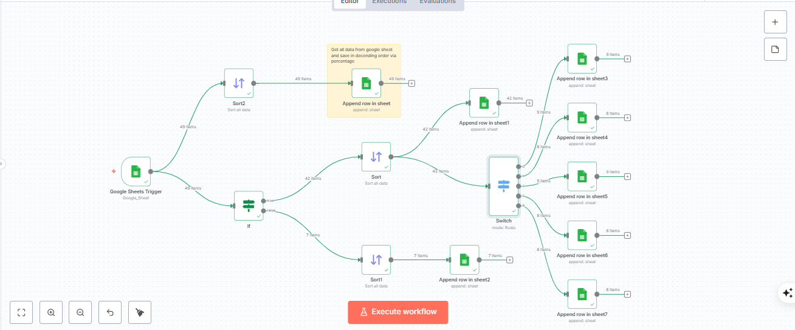
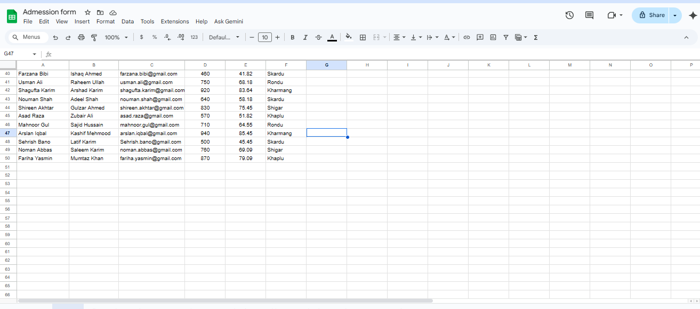
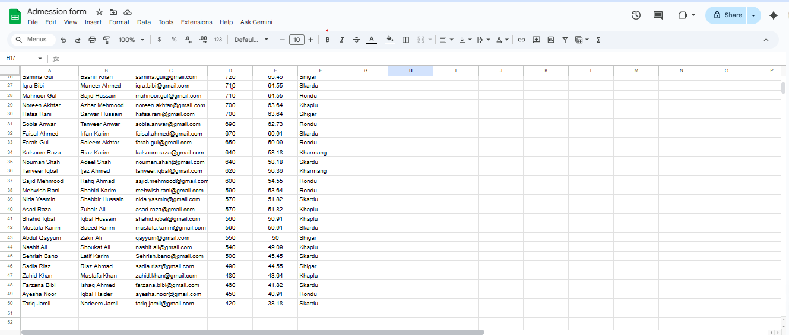
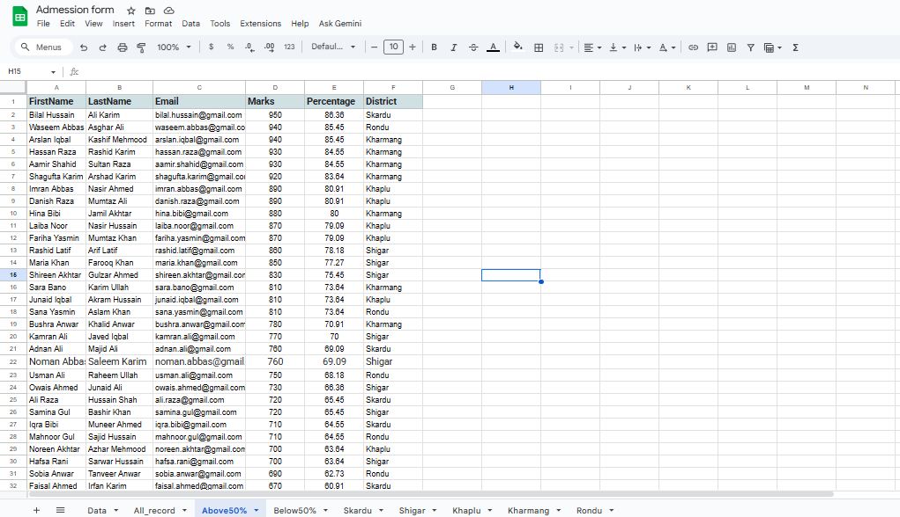
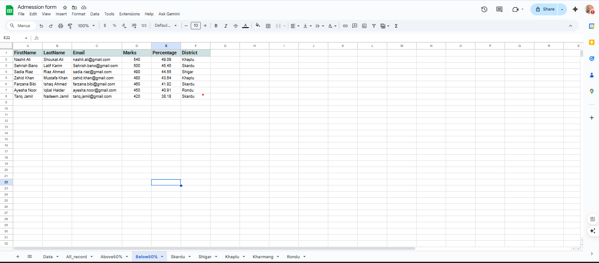
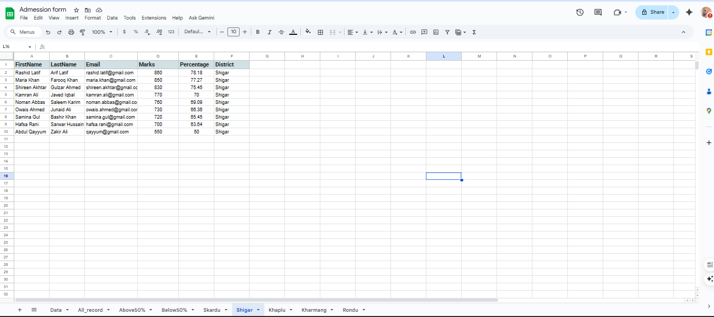

🎓 College & School Admission Automation with n8n

In the world of college and school admissions, sifting through countless applications can be a huge challenge. To solve this, I built a smart n8n workflow that automates the entire admission process making it faster, smarter, and error-free!

⚙️ How It Works 🧾 1. Google Sheets Integration

Student applications are collected through Google Forms and automatically saved in a Google Sheet.

🔄 2. Smart Data Sorting

The n8n workflow fetches all data from Google Sheets.

It sorts each record by percentage and stores it in a main google sheet for centralized access.

🎯 3. Merit-Based Filtering

An intelligent "If" condition checks every student’s percentage and automatically classifies them:

Above 50%: Students are moved to the “Above 50” sheet, eligible for the written test.

Below 50%: Students are added to the “Below 50” sheet, indicating they do not meet the merit criteria.

📍 4. Location & District Segregation

The workflow also creates separate sheets for students based on their location or district, making it easier to manage regional-level admissions and reporting.

💡 Why This Matters

✅ Saves countless hours of manual sorting and data entry. ✅ Eliminates errors that can occur during manual processing. ✅ Improves efficiency, allowing admission teams to focus on the right candidates. ✅ Leverages the power of automation to simplify complex administrative workflows.

🧠 Tools & Technologies

Automation Platform: n8n

Data Storage: Google Sheets

Data Source: Google Forms

Logic: n8n Conditional Nodes

📊 Visual Overview

Check out the visual workflow and automation results below 👇 
### 🧩 Workflow Overview

### 🧩 All Data Overview

### 🧩 All Sorted Data Overview

### 🧩 Above 50%

### 🧩 Below 50%

### 🧩 Distric Shigar

## 🎥 Admission Form Automation Demo

[▶️ Watch the Demo Video](https://github.com/YahyaShigri/AI-Automation/blob/main/video/admession-form-video.mp4)

🌟 Summary

This project demonstrates how AI-powered automation can transform traditional admission processes. From data collection to filtering and categorization, everything happens automatically — helping schools and colleges work smarter, not harder.
